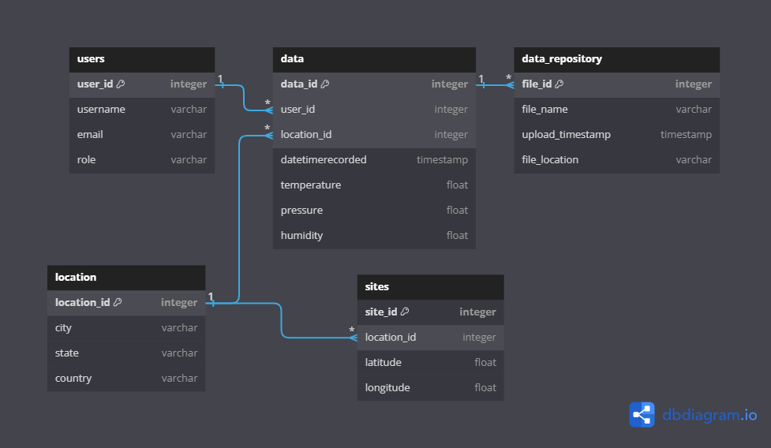

<!--
*** Thanks for checking out this README Template. If you have a suggestion that would
*** make this better, please fork the tinyml-mapping-backlight and create a pull request or simply open
*** an issue with the tag "suggest".
*** Thanks again! Now go create something AMAZING! :D
***
***
***
*** To avoid retyping too much info. Do a search and replace for the following:
*** fullmakeralchemist, tinyml-mapping-backlight, twitter_handle
-->

<!--#     The TensorFlow Microcontroller Challenge    -->
   <h1>Weather Data Collection</h1>

   <h2>Empowering Hydraulic Engineering in Mexico: Streamlining Data Collection for Environmental and Hydraulic Insights</h2>

<!-- PROJECT LOGO -->

<br />
<p align="center">

  <a href="https://github.com/fullmakeralchemist/">
    
  </a>
  -->
  <br />
  

  
  
  
  
  <a href="https://www.linkedin.com/in/padrondata/">
    
  </a>
  <!--
  <a href="https://twitter.com/makeralchemist/">
    
  </a>
  -->
  
  <!-- <h3 align="center">Tiny ML in Mapping Dance, Visual Arts and interactive museums</h3>-->
  <p align="center">
    <h2>:warning: No se gasto dinero en nube y hay un pdf tecnico de uso en AWS :warning:</h2>
    <h3>Demo de la app para subir csvs en Streamlit Share -------></h3>
    <br />
    <a href="https://subirs3.streamlit.app/"><strong>Proyecto Dashboard»</strong></a>
    <br />
  <br />
</p>
<br />

<!-- TABLE OF CONTENTS -->
## Table of Contents

* [About the Project](#about-the-project)
  * [Motivation](#motivation)
  * [Built With](#built-with)
* [Getting Started](#getting-started)
  * [Introduction](#introduction)
  * [Prerequisites](#prerequisites)
  * [Raspberry Pi 4 configuration to run the code](#raspberry-pi-4-configuration-to-run-the-code)
* [Creating a Streamlit WebApp for upload files from users](##creating-a-streamlit-webapp-for-upload-files-from-users)
  * [Setup in Windows](#setup-in-windows)
  * [Getting the MQTT library for the Arduino boards](#getting-the-mqtt-library-for-the-arduino-boards)
* [Methodology](#methodology)
  * [Arduino and Raspberry](#arduino-and-raspberry)
* [Database Design](#database-design)
  * [Key Entities](#key-entities)
  * [Relationships](#relationships)
  * [Key Entities](#key-entities)
* [Challenges I ran into and What I learned](#challenges-i-ran-into-and-what-i-learned)
* [Observations about the project](#observations-about-the-project)
* [Accomplishments that I'm proud of](#accomplishments-that-im-proud-of)
* [What's next for the project](#whats-next-for-weather-data-collection)
* [License](#license)
* [Contact](#contact)


<!-- ABOUT THE PROJECT -->
## About The Project

<!-- [](https://www.youtube.com/watch?v=3YUVTDTo-Zk) -->

Create a fundamental methodology for collecting environmental data with an open source and collaborative protocol, allowing a global or national community to contribute information about different places and cities. This project's main objective is to collect environmental data efficiently and accurately, using open source technologies and cloud platforms such as AWS to store and manage the collected information.

The proposed methodology will be based on the following fundamental principles:

1. Transparency: The entire data collection, analysis and management process will be transparent and accessible to the community. The protocols and procedures used will be clearly documented to ensure the reproducibility and reliability of the data.

2. Collaboration: Collaboration will be encouraged between different volunteer members to create a community, including researchers, scientists, environmental enthusiasts and citizens interested in contributing data. Open communication channels and collaborative platforms will be established to facilitate participation and knowledge sharing.

3. Standardization: Common data standards and formats will be defined to ensure consistency and compatibility between data collected from different sources and locations. This will facilitate the integration and analysis of data in a centralized platform.

4. Scalability: The methodology will be designed to be scalable and adaptable to different contexts and scales, from local communities to a global level. Technical solutions that can handle large volumes of data and ensure optimal performance even as the community grows will be considered.

5. Accessibility: The accessibility of the platform and the data collected will be prioritized, ensuring that they are easily accessible to anyone interested in using them for research, decision-making or environmental awareness, as well as donors for the maintenance of the project.

6. Privacy and security: Robust privacy and security measures will be implemented to protect data confidentiality and user privacy. Best practices in data security will be followed and clear privacy protection policies will be established.

By following this fundamental methodology, it is hoped to create a robust and collaborative platform for environmental data collection, which can be used by a broad community of users to address environmental challenges and contribute to scientific knowledge about the environment.

### Motivation

This project aims to establish a foundational methodology for environmental data collection through open-source protocols. It encompasses key phases, from data exploration and analysis to the development of a specialized data model designed to serve the field of hydraulics engineering and hydrology. Ultimately, the project's goal is to deploy a real-time weather data collection system by harnessing the power of IoT integrated into Arduino boards and Raspberry Pi.

#### Empowering Through IoT: Inclusive Data Solutions

The Internet of Things (IoT) has emerged as a powerful solution to conquer data challenges. It facilitates real-time data collection, customization tailored to specific issues, and predictive insights across various industries. However, ensuring security and privacy remains paramount in this interconnected landscape. IoT represents a transformative force, democratizing technology and unlocking its potential to be universally accessible and beneficial. With its boundless potential, IoT stands poised to revolutionize the way we interact with and utilize data, ushering in a new era of inclusive data solutions.

### Built With

With a lot of love 💖, motivation to help others 💪🏼 and [Python](https://www.python.org/) 🐍, using:

* [Arduino Opla IoT Kit](https://store-usa.arduino.cc/products/arduino-opla-iot-kit)
* [Raspberry Pi 4](https://www.raspberrypi.com/products/raspberry-pi-4-model-b/)
* Phone with HotSpot
* [Streamlit](https://streamlit.io/)

<!-- GETTING STARTED -->
## Getting Started

Weather data collection has historically posed a complex puzzle, but with the integration of the Internet of Things (IoT), we're fundamentally transforming our approach. Going beyond traditional forecasting methods, IoT harnesses sensor data to provide a more nuanced understanding of weather dynamics.
The Power of IoT
In the realm of weather forecasting, IoT represents a monumental advancement. By seamlessly collecting real-time data at the edge, it offers unprecedented insights into meteorological phenomena. Sensors, ranging from those monitoring temperature to wind speed, contribute to a comprehensive understanding of weather patterns. This is where IoT truly shines, empowering us to develop customized solutions tailored to address specific challenges.
The Intersection of IoT and Data Engineering

In the realm of modern data engineering, the integration of Internet of Things (IoT) technology has become increasingly prevalent, revolutionizing the way we collect, process, and analyze data. Here's how IoT and data engineering intersect and collaborate:

1. Data Collection at Scale: IoT devices generate vast amounts of data from various sources such as sensors, actuators, and other connected devices. Data engineering techniques are employed to design scalable data collection systems that can efficiently handle this influx of data in real-time.

2. Data Integration and Processing: Data engineering pipelines are utilized to integrate and preprocess data from IoT devices, ensuring its quality, reliability, and consistency. This involves tasks such as data cleansing, transformation, and aggregation to prepare the data for further analysis.

3. Streaming Data Processing: Many IoT applications require real-time processing of streaming data to enable timely decision-making. Data engineering frameworks like Apache Kafka and Apache Flink are often used to build robust streaming data pipelines capable of handling high throughput and low latency requirements.

4. Data Storage and Management: Data engineering involves designing and implementing storage solutions that can efficiently store and manage IoT data. This may include both traditional relational databases as well as distributed storage systems like cloud-based storage solutions such as Amazon S3.

5. Data Analytics and Insights: Once the data is collected, processed, and stored, data engineering techniques are applied to perform advanced analytics and derive actionable insights from the IoT data. This may involve building machine learning models, performing statistical analysis, or creating visualizations to understand patterns and trends.

6. Scalability and Performance: IoT data engineering solutions must be designed with scalability and performance in mind to accommodate the growing volume and velocity of data generated by IoT devices. This requires careful architectural design and optimization of data pipelines and storage systems.

In essence, the integration of IoT and data engineering enables organizations to harness the full potential of IoT technology by effectively managing and extracting value from the vast amounts of data generated by connected devices. It facilitates the development of innovative IoT applications and solutions that drive business value and enable digital transformation across industries. Once it fits perfectly, the picture becomes clear, and the forecast becomes accurate.

## Introduction 

As a hydraulic engineer, I have witnessed the significant challenges involved in obtaining high-quality data in the Mexican context. In particular, obtaining reliable data can be a formidable task, as experienced by many professionals in fields such as civil protection. My own colleagues often find themselves in the tedious task of manually copying and pasting information from multiple government portals into Excel spreadsheets, a time-consuming and error-prone process.

Faced with these challenges, I set out to revolutionize data collection in the environmental and hydraulic fields. Exploring the capabilities of open source Arduino-based hardware platforms, equipped with a variety of sensors including temperature, pressure and humidity, I discovered an efficient method to collect historical data in an automated manner. These data streams not only offer convenience, but also have the potential to provide robust data sets that can feed cutting-edge machine learning models.

The main goal of this project is to empower professionals like me and my colleagues as well as researchers and data enthusiasts, by integrating this large amount of data into a streamlined workflow. To achieve this, we combine Data Engineering techniques with cloud services such as AWS and orchestrators, in order to produce actionable insights that can drive analytics and predictive AI projects. This entire process is presented through an automated flow, facilitating the accessibility and usefulness of the data collected.

In doing so, we aim to transform the way hydraulic engineers and environmentalists access and use data, making it more accessible, actionable and capable of driving informed decision-making in critical areas such as flood prevention, water resources management. and the evaluation of environmental risks.

## Prerequisites 
Before getting a local copy up and running the project you need to first follow this simple steps: 
This is a list of things you need to use the software and how to install them. First we're gonna start with the configuration for our Raspberry Pi.

This is short list things you need to use the guide:

* AWS account free year. 
* Raspberry Pi 4
* Arduino IDE
* Micro USB Cable 
* Arduinos Boards mentioned above

### Raspberry Pi 4 configuration to run the code: 
We need to use Buster version of Raspberry Pi OS or another distribution such as Debian for the MQTT Broker. Before installing the libraries in your Linux Machine run the following code lines in the terminal: 

```
sudo apt update   
sudo apt upgrade   
```

After updating and upgrading we will write the following command to install the Mosquitto Broker enter these next commands: 

```
sudo apt install -y mosquitto mosquitto-clients   
```

Then type the following command, we have to modify a document that was installed to able the MQTT Broker as a public broker in your local WIFI network: 

```
sudo nano /etc/mosquitto/mosquitto.conf   
```

Now add the following lines at the end, without modify the rest of the document (Ctrl+x to save changes): 

```
listener 1883   
allow_anonymous true   
```

Then after saving the document, you have to restart the Mosquitto Broker run the following command and restart your Linux Machine: 

```
sudo systemctl restart mosquitto.service   
```

Also to configure the Broker to start when you start up your Raspberry Pi you have to run the following command in the terminal: 

```
sudo systemctl enable mosquitto.service   
```

To get the IP address that work for us as the direction of our broker run in the terminal the command: 

```
hostname -I   
```

One last thing to check if the Mosquitto broker is running and available run in the terminal the command: 

```
mosquitto -v   
```

Now finishing with the MQTT configuration we need to install the Library Paho-MQTT for Python to control and connect to the Broker, run the following command: 

```
apt search paho-mqtt  
sudo apt-get paho-mqtt

sudo pip install paho-mqtt==1.5.1 
 
```

## Creating a Streamlit WebApp for upload files from users
Streamlit is an open-source app framework for Machine Learning and Data Science teams. Create beautiful web apps in minutes. Streamlit apps are Python scripts that run from top to bottom. Every time a user opens a browser tab pointing to your app, the script is re-executed. As the script executes, Streamlit draws its output live in a browser.

[Create an app](https://docs.streamlit.io/library/get-started/create-an-app) using Streamlit’s core features to fetch and cache data, draw charts, plot information on a map, and use interactive widgets, like a slider, to filter results.

To setup your Raspberry Pi for the first time check [my tutorial](https://medium.com/@lalodatos/setting-up-your-raspberry-pi-4-wireless-cd3e70a53e3b).


Let’s prepare the virtual environment for the Streamlit app. First let’s create a virtual environment and once created then activate it (Raspberry Pi OS).

```
python -m venv env
source/env/bin/activate
```

Then we have to install boto3 and Streamlit. Try to install in the next order.

```
pip install streamlit
pip install boto3
```

After this we are ready to try the hello world in Streamlit to check that everything is installed correctly. Create a file called app.py and put the next code lines using your favorite IDE:

```
import streamlit as st
st.write("Hello, World!")
```

Then run it from the terminal in cmd and if everything works fine will open the browser.

```
streamlit run app.py
```

Then to create a tool to upload the data files from our weather data to S3 in the AWS account  model we need to open the code editor and let’s get started by replacing the credentials, paths and bucket name, and for the moment is everything. Now let’s go to the next step.

### Setup in Windows
Is time to configure and set everything on Windows (What I used) to obtain the data and to upload the codes to the boards that we are going to use: First of all we are going to set up the Arduino IDE for the board used in the project. After installing the Arduino IDE in your computer it is necessary to install in the board manager the core needed for each board here are the links to see the Documentation from Arduino as a quick start guide for each board. 

* [Arduino Opla IoT Kit](https://store-usa.arduino.cc/products/arduino-opla-iot-kit)

For the Oplá IoT Kit it is necessary to install the library Arduino SAMD Boards in the Boards Manager from the IDE. This one is for The Arduino MKR WiFi 1010 that is attached to the Opla Carrier to load the code.

<p align="center">

</p>

For the Oplá IoT Kit it is necessary to install the library WiFiNINA by Arduino in the library Manager from the IDE. This one is for WIFI connectivity. 

For the Oplá IoT Kit Board it is necessary to install the library Arduino_MKRIoTCarrier by Arduino in the library Manager from the IDE. This one is for the Carrier control for the sensors. 

### Getting the MQTT library for the Arduino boards: 

For the Arduino Oplá to interact with the Raspberry Pi broker, you need to install the [PubSubClient library](https://github.com/knolleary/pubsubclient). This library provides a client for doing simple publish/subscribe messaging with a server that supports MQTT (basically allows your Arduino to talk with a MQTT Broker). 

[Click here to download the PubSubClient library](https://github.com/knolleary/pubsubclient/archive/master.zip). You should have a .zip folder in your Downloads folder Unzip the .zip folder and you should get pubsubclient-master folder Rename your folder from pubsubclient-master to pubsubclient Move the pubsubclient folder to your Arduino IDE installation libraries folder Then, re-open your Arduino IDE.

The last library is array.h that I included in my repo in the Folder Libraries Because I forgot where I got it [Library](https://github.com/fullmakeralchemist/weather_prediction/tree/master/library/), repeat the same steps from the PubSubClient library to use it.

Finally we have everything setup in our Arduino IDE and we can start using the boards, but before doing that we need to set up everything in our windows machine, upload and  run our code.

As mentioned before we are going to use the Raspberry to install a broker and this broker will work as show in the image below.

## Methodology

<p align="center">

</p>

Project Description: The main objective of the project is to create a foundational methodology for collecting environmental data using an open-source protocol. To achieve this, the following technical stages will be carried out:

1. Exploratory Data Analysis (EDA):
 Conduct an exploratory analysis of the available data to better understand its nature and characteristics.
 Identify patterns, trends, and potential issues in the data that may influence the design of the collection methodology.

2. Data Model Design:
Utilize knowledge in hydraulics and hydrology to design a structured data model that effectively captures relevant environmental variables for hydraulic engineering.
Define the necessary data structure to properly represent the collected information and facilitate its analysis and subsequent use.

3. Arduino Data Collection: 
Utilize Arduino-based sensors for the collection of real-time data on temperature, pressure, humidity, and other relevant variables if the project looks necessary. This approach provides a cost-effective and efficient means of acquiring valuable data.

4. Preparation of the AWS Platform:
 Set up an account on Amazon Web Services (AWS) and prepare the necessary infrastructure to receive and store the collected data.
 Establish a bucket in Amazon Simple Storage Service (S3) to securely and scalably store the data.
Implement a process to upload the collected data to Amazon S3, a scalable and secure cloud storage service. This step ensures that the data is safely stored and easily accessible for further processing and analysis.

5. Deployment of Data Collection Devices:
 Implement a Raspberry Pi device as a communication bridge between Arduino sensors and the AWS platform.
 Configure the Raspberry Pi to receive data from Arduino sensors and transmit it to the AWS bucket using a secure communication protocol.

6. Streamlit Deployment: 
Develop an intuitive and user-friendly web application using Streamlit, which will serve as a secondary option to upload and review data files. 
A key feature of the Streamlit app will be the ability to save the collected data as CSV files. This serves as a starting point for building a local data repository for weather-related information. Over time, this repository will grow, providing valuable historical data for local analysis and decision-making.

5. Testing and Validation of the System:
 Perform comprehensive testing of the system to ensure its proper operation and the integrity of the collected data.
 Validate the accuracy and consistency of the collected data through comparisons with reference data sources and manual measurements, where possible.

Functioning desire result:
<p align="center">

</p>

This is how it will work in Raspberry Pi with the code [read_data_ard.py](https://github.com/fullmakeralchemist/dataengweather/blob/master/read_data_ard.py):
<p align="center">

</p>

In the Arduino will look like this with the code [opla_sensors_mqtt_deng](https://github.com/fullmakeralchemist/dataengweather/tree/master/opla_sensors_mqtt_deng):

<p align="center">

</p>

It should look like this one is succesfully connected and working:

<p align="center">

</p>


## [Arduino and Raspberry](https://medium.com/@lalodatos/applications-with-raspberry-pi-and-arduino-using-mqtt-b6594c29aed8)

With all the elements the final structure of the project is like this:

<p align="center">

</p>

Now it's time to go back to the Raspberry Pi env we created before we need to put the code folder in that folder containing all the elements from this repo and run to obtain the file with the first records.

Also to run the code change the broker number for the IP from the Raspberry Pi in the [app.py](https://github.com/fullmakeralchemist/dataengweather/blob/master/app.py)

It's time to run in Raspberry Pi:

```
streamlit run app.py
```

Once you run it it should look like this:

<p align="center">

</p>

When the app will upload a flle will look like this:

<p align="center">

</p>

Another option is save data in SD card in the Opla Kit that is an available option to avoid using communication protocol, is the scenario that a sensor is located is a place that is not available for communication protocols can be used a battery and a sd card to collect the data and upload in specific periods of time. (Will add this code later)

## Database Design
### Entity-Relationship Diagram (ERD)
Our database schema is represented using an Entity-Relationship Diagram (ERD), which visually illustrates the relationships between different entities in the database. The ERD provides a clear overview of how various components of the database are interconnected and how data flows within the system.
### Key Entities
The database schema includes several key entities:

Users: Representing individuals who interact with the data collection system.
Locations: Representing geographical locations where data collection sites are situated.
Sites: Representing specific sites or locations where data collection occurs.
Data: Representing collected environmental data, including temperature, pressure, humidity, and timestamps.
Data_Repository: Representing the repository where collected data is stored, such as CSV files.
### Relationships
The relationships between these entities are established to maintain data integrity and facilitate efficient data retrieval:

Each location can have multiple sites, but each site belongs to only one location (one-to-many relationship between Locations and Sites).
Each user can upload or access multiple pieces of data, but each piece of data is associated with only one user (one-to-many relationship between Users and Data).
Each piece of data stored in the Data entity is associated with exactly one entry in the Data_Repository, representing where the data is stored (one-to-one relationship between Data and Data_Repository).
And the ERD look like this as a first version: 

<p align="center">

</p>

After this I run the code and I get this file:

<p align="center">

</p>

After using the streamlit app I upload the file and in the S3 bucket look like this:
<p align="center">

</p>

## Tutorial of how to setup to create a Lake House in AWS

I didn't have enough time to add this documentation to the repo but here is the pdf version:

Run the following tutorial [following tutorial](https://github.com/fullmakeralchemist/dataengweather/blob/master/pdf/DE%20Documentacion%20flujo%20csv%20AWS.pdf) to start working with a workflow of data in AWS.

The code of the Lambda function can be found in [lambda.py](https://github.com/fullmakeralchemist/dataengweather/blob/master/lambda.py)

## Challenges I ran into and What I learned

One of the main challenges was finding how to send data from Arduino directly to AWS. As such, there is no documentation about it. Currently, the only option available is using one intermediary as it is Raspberry Pi to use it as a channel of obtaining the data automatically but it has a cost getting one and setting it.

The second main challenge was how many data variables can we read on an Arduino card since only few cards have the capacity to read specific sensors, these cards mostly do not have the necessary sensors to read the necessary pressure, humidity and temperature data. In addition, they only have Bluetooth communication, which makes communication with Streamlit difficult.

Finally, this is the first time I've used AWS API with Streamlit. In the end, I learned that whenever you may think that you found no way out, motivation can help you find alternative solutions with these resources.


## Observations about the project

Streamlit Share needs a special env variable for the credentials in AWS here is the link for documentation. Due to lack of time and knowledge of cloud tools that allow Streamlit Share to communicate with Arduino remotely using the communication protocol used, this project can only be used at the moment to communicate locally and send the data to S3 using Raspberry Pi also is really difficult and not recomendable using Windows to manage local brokers.

In addition, the Streamlit app has 1 path to save files for just one user. It is necessary to implement the route for different users to avoid putting data from different users to just one folder.

The data set is just for temperature, pressure and humidity is necessary to do implement more sensors to get more data also the time is set to register data each 20 seconds is necessary to do more research about the timing of records this can increase the size of the data, also for the moment i don’t have the calculation about how many data can be saved in the bucket and the cost so having data from multiple users and historical data.

## Accomplishments that I'm proud of

- Creation of a custom script to collect information and the option to include more variables.
- Building an ERD model with a first structure analyzing possible options for data.
- Apply knowledge of communication protocols with Data Engineering real time data collection.
- Create an app using Streamlit.
- Start creating a tool that will help others.

## What's next for Weather Data Collection

- Find more options to send data from Arduino to AWS
- Obtain more information and, if possible, include more variables and sensors.
- Add the option to do dashboarding with the collected data to the app.

## License


<!-- CONTACT -->
## Contact

Eduardo Padron - [LinkedIn: @padrondata](https://www.linkedin.com/in/padrondata/)